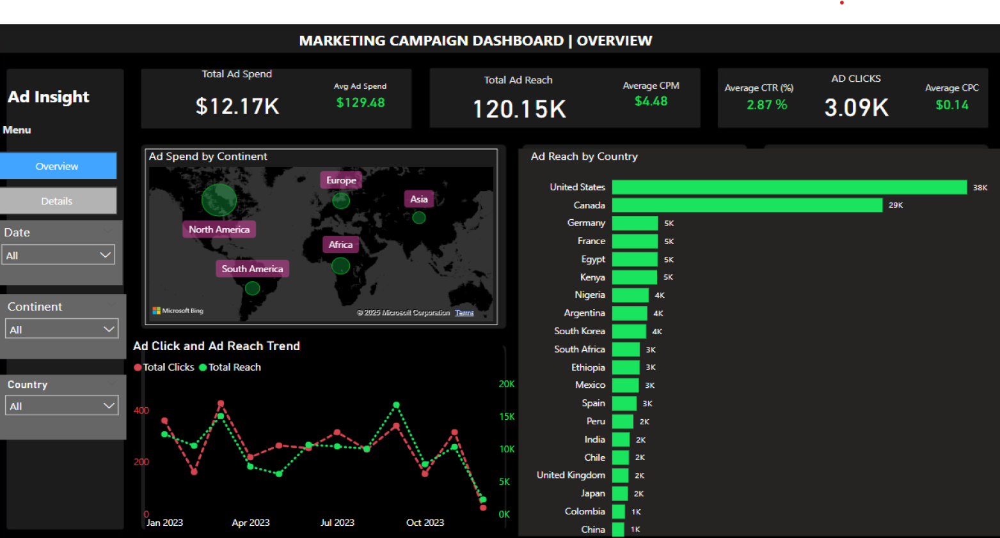
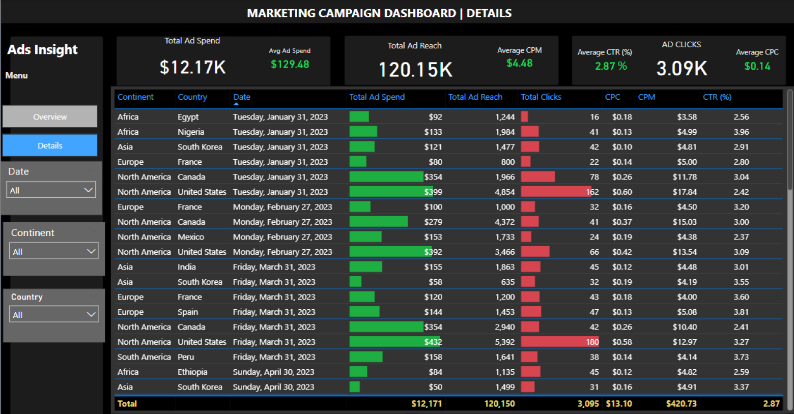

# BrandElevate's 2023 Advertising 

## Table of Contents
1. [Project Overview](#project-overview)
2. [Business Introduction](#business-introduction)
3. [Problem Statement](#problem-statement)
4. [Tools Used](#tools-used)
5. [Key Findings](#key-findings)
6. [Dashboard Insights](#dashboard-insights)
7. [Conclusion](#conclusion)

---

## Project Overview
This project analyzes digital advertising performance data from 2023, focusing on trends, efficiencies, and opportunities in ad spend, reach, and engagement. Using Power BI and Excel, the report aims to uncover actionable insights that can guide future marketing decisions and optimize advertising strategies.

---

## Business Introduction
**BrandElevate** is a digital marketing agency specializing in data-driven marketing solutions. By leveraging advanced analytics tools, BrandElevate helps clients optimize advertising strategies and maximize ROI. The agency provides valuable insights to improve campaign performance and drive business growth.

---

## Problem Statement
Companies face challenges in:
- Managing and analyzing large volumes of advertising data.
- Identifying performance trends and areas for improvement.
- Optimizing ad spend to maximize reach and engagement.

This project addresses these issues by analyzing advertising data to reveal patterns and insights that support better decision-making for resource allocation.

---

## Tools Used
- **Power BI**: Utilized for creating interactive dashboards that visualize key metrics and campaign performance.
- **Excel**: Used for data cleaning, preparation, and preliminary analysis before integration with Power BI.

---

## Key Findings
- **Ad Spend Distribution**: Total ad spend was $12.17K, with the highest allocations in North America and Europe. Emerging markets like Asia and South America showed lower spend, indicating growth potential.
- **Performance Metrics**: Average Cost Per Mille (CPM) was $4.48, and the Click-Through Rate (CTR) was 2.87%, surpassing industry benchmarks.
- **Geographical Performance**: The U.S., Canada, and Germany had the highest ad reach. Regional differences suggest the need for market-specific campaigns.
- **Temporal Trends**: Ad performance fluctuated seasonally, with certain months showing peak performance and differences between weekend and weekday engagement.
- **ROI Analysis**: Higher investments didn’t always correlate with better engagement. Long-term campaigns generally performed better.
- **Audience Segmentation**: Custom audience targeting outperformed broad demographic targeting across regions.
- **Platform-Specific Performance**: Mobile engagement exceeded desktop, suggesting a need for mobile optimization.

---

## Dashboard Insights
The Power BI dashboard consists of two main pages:

### Page 1: Performance Overview
- **KPI Cards**: Display total ad spend ($12.17K), reach (120.15K impressions), average CPM ($4.48), average CTR (2.87%), and average CPC ($0.14).
- **Geographical Distribution Map**: Highlights regions with the highest ad reach.
- **Ad Spend by Continent**: A bar chart showing ad spend distribution across continents.
- **Performance Metrics by Country**: A table comparing key metrics (spend, reach, clicks, CPM, CPC, CTR) across countries.

### Page 2: Trend Analysis & Detailed Metrics
- **Ad Click and Reach Trend**: A time-series chart showing fluctuations in clicks and reach.
- **Campaign Performance**: Scatter plot comparing ad spend and engagement metrics.
- **Ad Format Comparison**: Analysis of different ad formats (image, video, carousel) and their performance.
- **Heatmap**: Visualizes engagement patterns across days of the week and times of day.
- **Audience Segment Performance**: Breakdown of performance by demographic segments.

---

## Conclusion
This comprehensive analysis and interactive Power BI dashboard offer valuable insights to optimize future advertising campaigns. By focusing on data-driven strategies, BrandElevate can enhance client ROI and improve online presence and engagement.
